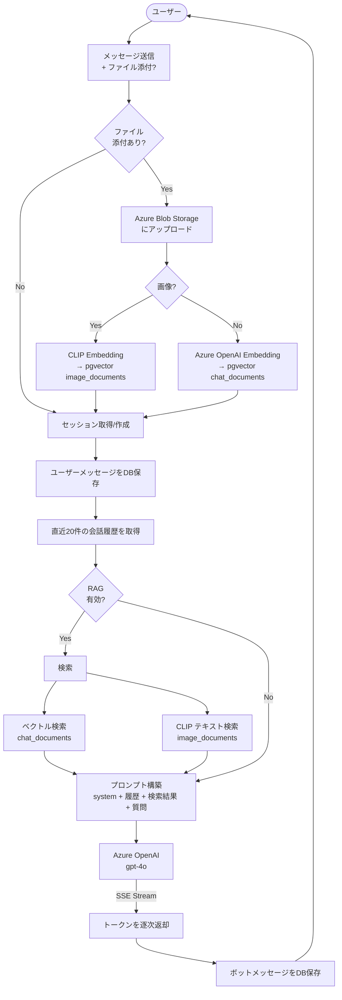

# chat-sandbox RAGチャットフロー

```mermaid
flowchart TD
    User([ユーザー]) --> Input[メッセージ送信<br/>+ ファイル添付?]

    Input --> Upload{ファイル<br/>添付あり?}
    Upload -->|Yes| Blob[Azure Blob Storage<br/>にアップロード]
    Blob --> Process{画像?}
    Process -->|Yes| CLIP[CLIP Embedding<br/>→ pgvector image_documents]
    Process -->|No| TextEmbed[Azure OpenAI Embedding<br/>→ pgvector chat_documents]
    Upload -->|No| Session

    CLIP --> Session
    TextEmbed --> Session

    Session[セッション取得/作成] --> SaveUser[ユーザーメッセージをDB保存]
    SaveUser --> History[直近20件の会話履歴を取得]

    History --> RAG{RAG<br/>有効?}

    RAG -->|Yes| Retrieve[検索]
    Retrieve --> VectorSearch[ベクトル検索<br/>chat_documents]
    Retrieve --> ImageSearch[CLIP テキスト検索<br/>image_documents]
    VectorSearch --> BuildPrompt
    ImageSearch --> BuildPrompt

    RAG -->|No| BuildPrompt

    BuildPrompt[プロンプト構築<br/>system + 履歴 + 検索結果 + 質問]

    BuildPrompt --> LLM[Azure OpenAI<br/>gpt-4o]
    LLM -->|SSE Stream| Response[トークンを逐次返却]
    Response --> SaveBot[ボットメッセージをDB保存]
    SaveBot --> User
```
