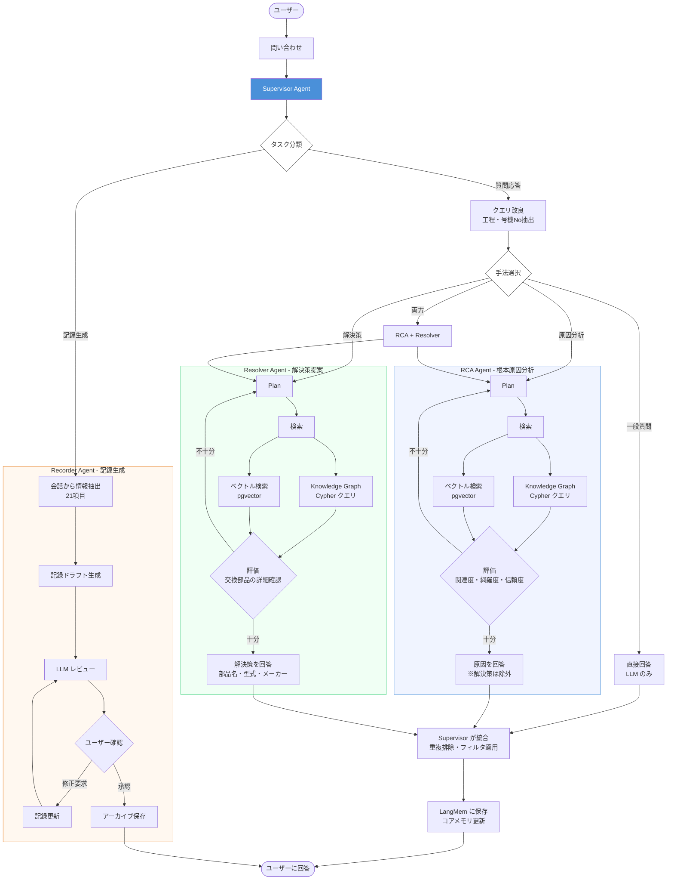

# cmos-maintenance-app マルチエージェントフロー

```mermaid
flowchart TD
    User([ユーザー]) --> Query[問い合わせ]

    Query --> Supervisor[Supervisor Agent]

    %% Task Routing
    Supervisor --> TaskRouter{タスク分類}
    TaskRouter -->|質問応答| QueryRefine[クエリ改良<br/>工程・号機No抽出]
    TaskRouter -->|記録生成| Recorder

    %% Method Routing
    QueryRefine --> MethodRouter{手法選択}
    MethodRouter -->|一般質問| DirectAnswer[直接回答<br/>LLM のみ]
    MethodRouter -->|原因分析| RCA
    MethodRouter -->|解決策| Resolver
    MethodRouter -->|両方| BOTH[RCA + Resolver]

    %% RCA Agent
    subgraph RCA_Agent[RCA Agent - 根本原因分析]
        RCA[Plan] --> RCA_Retrieve[検索]
        RCA_Retrieve --> RCA_Cypher[Knowledge Graph<br/>Cypher クエリ]
        RCA_Retrieve --> RCA_Vector[ベクトル検索<br/>pgvector]
        RCA_Cypher --> RCA_Eval{評価<br/>関連度・網羅度・信頼度}
        RCA_Vector --> RCA_Eval
        RCA_Eval -->|不十分| RCA
        RCA_Eval -->|十分| RCA_Answer[原因を回答<br/>※解決策は除外]
    end

    %% Resolver Agent
    subgraph Resolver_Agent[Resolver Agent - 解決策提案]
        Resolver[Plan] --> Res_Retrieve[検索]
        Res_Retrieve --> Res_Cypher[Knowledge Graph<br/>Cypher クエリ]
        Res_Retrieve --> Res_Vector[ベクトル検索<br/>pgvector]
        Res_Cypher --> Res_Eval{評価<br/>交換部品の詳細確認}
        Res_Vector --> Res_Eval
        Res_Eval -->|不十分| Resolver
        Res_Eval -->|十分| Res_Answer[解決策を回答<br/>部品名・型式・メーカー]
    end

    %% Recorder Agent
    subgraph Recorder_Agent[Recorder Agent - 記録生成]
        Recorder[会話から情報抽出<br/>21項目] --> Draft[記録ドラフト生成]
        Draft --> Review[LLM レビュー]
        Review --> UserReview{ユーザー確認}
        UserReview -->|修正要求| Update[記録更新]
        Update --> Review
        UserReview -->|承認| Archive[アーカイブ保存]
    end

    %% Merge
    BOTH --> RCA
    BOTH --> Resolver

    DirectAnswer --> Integrate
    RCA_Answer --> Integrate
    Res_Answer --> Integrate

    Integrate[Supervisor が統合<br/>重複排除・フィルタ適用]

    %% Memory
    Integrate --> Memory[LangMem に保存<br/>コアメモリ更新]
    Memory --> Response([ユーザーに回答])
    Archive --> Response

    %% Styling
    style Supervisor fill:#4A90D9,color:#fff
    style RCA_Agent fill:#f0f4ff,stroke:#4A90D9
    style Resolver_Agent fill:#f0fff4,stroke:#2ecc71
    style Recorder_Agent fill:#fff8f0,stroke:#e67e22
    style TaskRouter fill:#fff,stroke:#333
    style MethodRouter fill:#fff,stroke:#333
```
