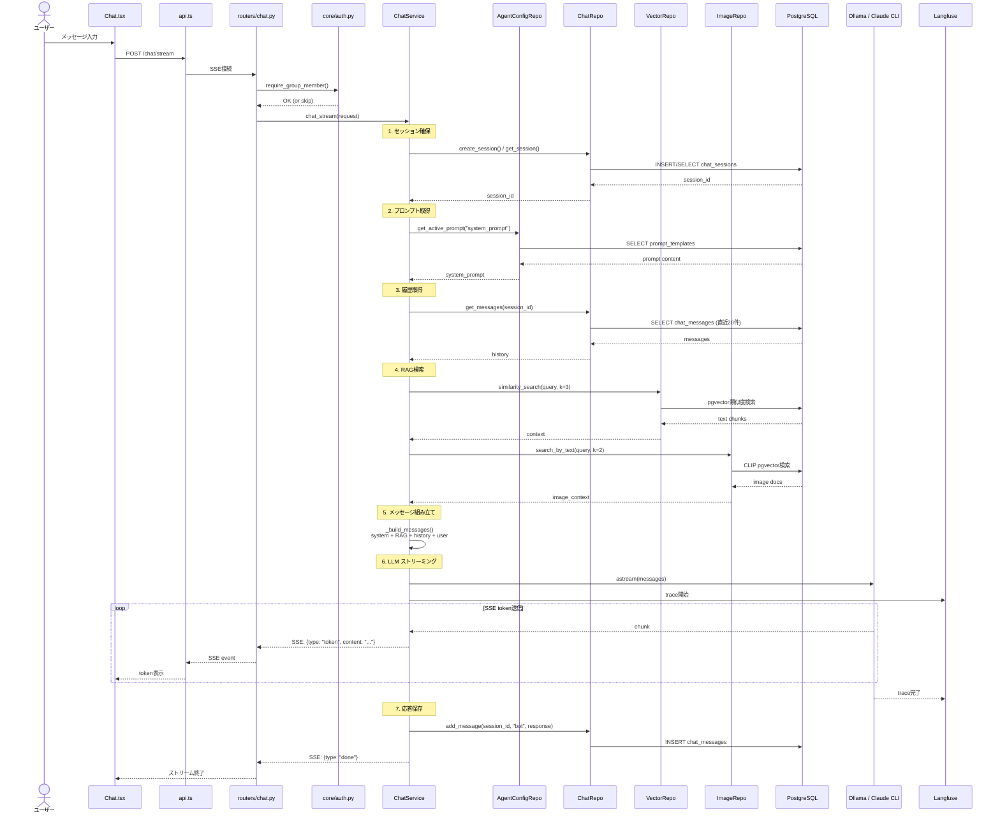
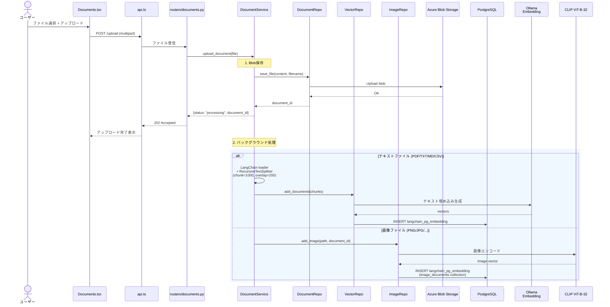
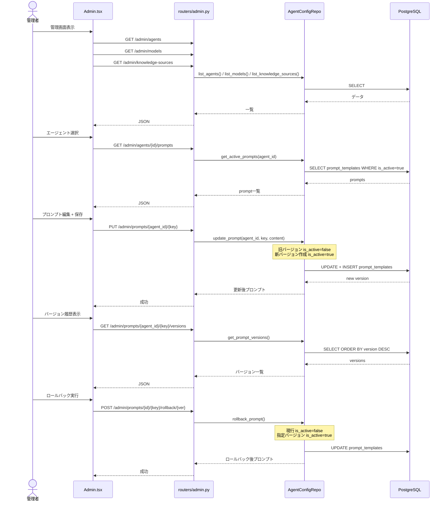
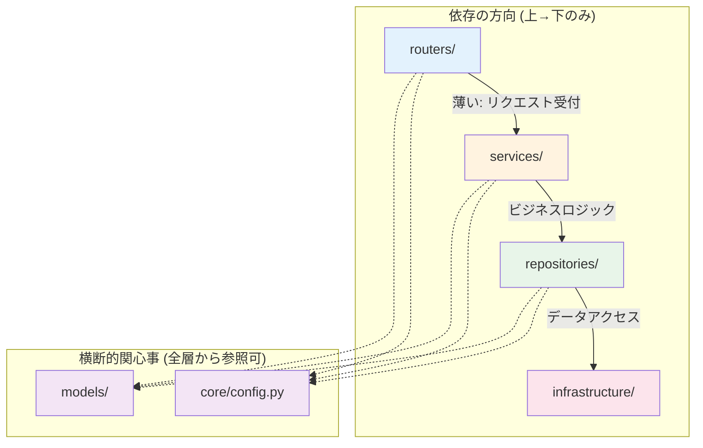

# アーキテクチャ・モジュールフロー図

## 1. 全体構成図

```mermaid
graph TB
    subgraph Frontend["Frontend (React 19 + Vite)"]
        main[main.tsx]
        App[App.tsx]
        ChatPage[pages/Chat.tsx]
        DocsPage[pages/Documents.tsx]
        AdminPage[pages/Admin.tsx]
        ChatWindow[components/ChatWindow.tsx]
        MessageInput[components/MessageInput.tsx]
        Sidebar[components/Sidebar.tsx]
        ApiService[services/api.ts]

        main --> App
        App --> ChatPage
        App --> DocsPage
        App --> AdminPage
        ChatPage --> ChatWindow
        ChatPage --> MessageInput
        ChatPage --> Sidebar
        ChatPage --> ApiService
        DocsPage --> ApiService
        AdminPage --> ApiService
    end

    subgraph Backend["Backend (FastAPI + Python 3.11)"]
        subgraph Core["core/"]
            Config[config.py<br/>Settings]
            Deps[dependencies.py<br/>DIコンテナ]
            Auth[auth.py<br/>Entra ID検証]
            Logging[logging.py]
        end

        subgraph Routers["routers/"]
            RChat[chat.py]
            RDocs[documents.py]
            RSessions[sessions.py]
            RAdmin[admin.py]
            RSpeech[speech.py<br/>スタブ]
        end

        subgraph Services["services/"]
            ChatSvc[chat_service.py]
            DocSvc[document_service.py]
        end

        subgraph Repositories["repositories/"]
            VectorRepo[vector_repository.py]
            ImageRepo[image_repository.py]
            ChatRepo[chat_repository.py]
            DocRepo[document_repository.py]
            AgentRepo[agent_config_repository.py]
        end

        subgraph Infra["infrastructure/"]
            CLIP[clip_embeddings.py<br/>CLIP ViT-B-32]
        end

        subgraph Models["models/"]
            MChat[chat.py]
            MDoc[document.py]
            MAgent[agent_config.py]
        end

        MainPy[main.py] --> Deps
        MainPy --> RChat
        MainPy --> RDocs
        MainPy --> RSessions
        MainPy --> RAdmin

        Deps --> ChatSvc
        Deps --> DocSvc
        Deps --> VectorRepo
        Deps --> ImageRepo
        Deps --> ChatRepo
        Deps --> DocRepo
        Deps --> AgentRepo

        RChat --> Auth
        RChat --> ChatSvc
        RDocs --> DocSvc
        RSessions --> ChatRepo
        RAdmin --> AgentRepo

        ChatSvc --> VectorRepo
        ChatSvc --> ImageRepo
        ChatSvc --> ChatRepo
        ChatSvc --> AgentRepo
        ChatSvc --> Config
        ChatSvc --> MChat

        DocSvc --> VectorRepo
        DocSvc --> ImageRepo
        DocSvc --> DocRepo
        DocSvc --> MDoc

        VectorRepo --> Config
        ImageRepo --> Config
        ImageRepo --> CLIP
        ChatRepo --> MChat
        DocRepo --> MDoc
        AgentRepo --> MAgent
    end

    subgraph External["外部サービス"]
        PG[(PostgreSQL 16<br/>+ pgvector)]
        Blob[(Azure Blob<br/>Storage)]
        AOAI[Ollama / Claude CLI<br/>DB設定で切替]
        Embed[Ollama<br/>nomic-embed-text]
        LF[Langfuse v3<br/>トレーシング]
    end

    ApiService -- "HTTP :8000" --> RChat
    ApiService -- "HTTP :8000" --> RDocs
    ApiService -- "HTTP :8000" --> RSessions
    ApiService -- "HTTP :8000" --> RAdmin

    VectorRepo --> PG
    ImageRepo --> PG
    ChatRepo --> PG
    AgentRepo --> PG
    DocRepo --> Blob
    ChatSvc --> AOAI
    ChatSvc --> LF
    VectorRepo --> Embed
    CLIP -.-> ImageRepo
```

## 2. チャットリクエストフロー

```mermaid
sequenceDiagram
    actor User as ユーザー
    participant Chat as Chat.tsx
    participant API as api.ts
    participant Router as routers/chat.py
    participant Auth as core/auth.py
    participant Svc as ChatService
    participant AgentCfg as AgentConfigRepo
    participant ChatDB as ChatRepo
    participant Vec as VectorRepo
    participant Img as ImageRepo
    participant PG as PostgreSQL
    participant LLM as Ollama / Claude CLI
    participant LF as Langfuse

    User->>Chat: メッセージ入力
    Chat->>API: POST /chat/stream
    API->>Router: SSE接続

    Router->>Auth: require_group_member()
    Auth-->>Router: OK (or skip)

    Router->>Svc: chat_stream(request)

    Note over Svc: 1. セッション確保
    Svc->>ChatDB: create_session() / get_session()
    ChatDB->>PG: INSERT/SELECT chat_sessions
    PG-->>ChatDB: session_id
    ChatDB-->>Svc: session_id

    Note over Svc: 2. プロンプト取得
    Svc->>AgentCfg: get_active_prompt("system_prompt")
    AgentCfg->>PG: SELECT prompt_templates
    PG-->>AgentCfg: prompt content
    AgentCfg-->>Svc: system_prompt

    Note over Svc: 3. 履歴取得
    Svc->>ChatDB: get_messages(session_id)
    ChatDB->>PG: SELECT chat_messages (直近20件)
    PG-->>ChatDB: messages
    ChatDB-->>Svc: history

    Note over Svc: 4. RAG検索
    Svc->>Vec: similarity_search(query, k=3)
    Vec->>PG: pgvector類似度検索
    PG-->>Vec: text chunks
    Vec-->>Svc: context

    Svc->>Img: search_by_text(query, k=2)
    Img->>PG: CLIP pgvector検索
    PG-->>Img: image docs
    Img-->>Svc: image_context

    Note over Svc: 5. メッセージ組み立て
    Svc->>Svc: _build_messages()<br/>system + RAG + history + user

    Note over Svc: 6. LLM ストリーミング
    Svc->>LLM: astream(messages)
    Svc->>LF: trace開始

    loop SSE token送信
        LLM-->>Svc: chunk
        Svc-->>Router: SSE: {type: "token", content: "..."}
        Router-->>API: SSE event
        API-->>Chat: token表示
    end

    LLM-->>LF: trace完了

    Note over Svc: 7. 応答保存
    Svc->>ChatDB: add_message(session_id, "bot", response)
    ChatDB->>PG: INSERT chat_messages

    Svc-->>Router: SSE: {type: "done"}
    Router-->>Chat: ストリーム終了
```

## 3. ドキュメントアップロードフロー

```mermaid
sequenceDiagram
    actor User as ユーザー
    participant Docs as Documents.tsx
    participant API as api.ts
    participant Router as routers/documents.py
    participant Svc as DocumentService
    participant BlobRepo as DocumentRepo
    participant VecRepo as VectorRepo
    participant ImgRepo as ImageRepo
    participant Blob as Azure Blob Storage
    participant PG as PostgreSQL
    participant Embed as Ollama<br/>Embedding
    participant CLIP as CLIP ViT-B-32

    User->>Docs: ファイル選択 + アップロード
    Docs->>API: POST /upload (multipart)
    API->>Router: ファイル受信

    Router->>Svc: upload_document(file)

    Note over Svc: 1. Blob保存
    Svc->>BlobRepo: save_file(content, filename)
    BlobRepo->>Blob: Upload blob
    Blob-->>BlobRepo: OK
    BlobRepo-->>Svc: document_id

    Svc-->>Router: {status: "processing", document_id}
    Router-->>API: 202 Accepted
    API-->>Docs: アップロード完了表示

    Note over Svc: 2. バックグラウンド処理
    rect rgb(240, 248, 255)
        alt テキストファイル (PDF/TXT/MD/CSV)
            Svc->>Svc: LangChain loader<br/>+ RecursiveTextSplitter<br/>(chunk=1000, overlap=200)
            Svc->>VecRepo: add_documents(chunks)
            VecRepo->>Embed: テキスト埋め込み生成
            Embed-->>VecRepo: vectors
            VecRepo->>PG: INSERT langchain_pg_embedding
        else 画像ファイル (PNG/JPG/...)
            Svc->>ImgRepo: add_image(path, document_id)
            ImgRepo->>CLIP: 画像エンコード
            CLIP-->>ImgRepo: image vector
            ImgRepo->>PG: INSERT langchain_pg_embedding<br/>(image_documents collection)
        end
    end
```

## 4. 管理画面フロー

```mermaid
sequenceDiagram
    actor Admin as 管理者
    participant Page as Admin.tsx
    participant Router as routers/admin.py
    participant Repo as AgentConfigRepo
    participant PG as PostgreSQL

    Admin->>Page: 管理画面表示
    Page->>Router: GET /admin/agents
    Page->>Router: GET /admin/models
    Page->>Router: GET /admin/knowledge-sources
    Router->>Repo: list_agents() / list_models() / list_knowledge_sources()
    Repo->>PG: SELECT
    PG-->>Repo: データ
    Repo-->>Router: 一覧
    Router-->>Page: JSON

    Admin->>Page: エージェント選択
    Page->>Router: GET /admin/agents/{id}/prompts
    Router->>Repo: get_active_prompts(agent_id)
    Repo->>PG: SELECT prompt_templates WHERE is_active=true
    PG-->>Repo: prompts
    Repo-->>Router: prompt一覧
    Router-->>Page: JSON

    Admin->>Page: プロンプト編集 + 保存
    Page->>Router: PUT /admin/prompts/{agent_id}/{key}
    Router->>Repo: update_prompt(agent_id, key, content)

    Note over Repo: 旧バージョン is_active=false<br/>新バージョン作成 is_active=true
    Repo->>PG: UPDATE + INSERT prompt_templates
    PG-->>Repo: new version
    Repo-->>Router: 更新後プロンプト
    Router-->>Page: 成功

    Admin->>Page: バージョン履歴表示
    Page->>Router: GET /admin/prompts/{agent_id}/{key}/versions
    Router->>Repo: get_prompt_versions()
    Repo->>PG: SELECT ORDER BY version DESC
    PG-->>Repo: versions
    Repo-->>Router: バージョン一覧
    Router-->>Page: JSON

    Admin->>Page: ロールバック実行
    Page->>Router: POST /admin/prompts/{id}/{key}/rollback/{ver}
    Router->>Repo: rollback_prompt()
    Note over Repo: 現行 is_active=false<br/>指定バージョン is_active=true
    Repo->>PG: UPDATE prompt_templates
    Repo-->>Router: ロールバック後プロンプト
    Router-->>Page: 成功
```

## 5. レイヤー依存方向 (まとめ)

```mermaid
graph TD
    subgraph "依存の方向 (上→下のみ)"
        R[routers/] -->|"薄い: リクエスト受付"| S[services/]
        S -->|"ビジネスロジック"| Repo[repositories/]
        Repo -->|"データアクセス"| I[infrastructure/]
    end

    subgraph "横断的関心事 (全層から参照可)"
        C[core/config.py]
        M[models/]
    end

    R -.-> C
    R -.-> M
    S -.-> C
    S -.-> M
    Repo -.-> C
    Repo -.-> M

    style R fill:#e3f2fd
    style S fill:#fff3e0
    style Repo fill:#e8f5e9
    style I fill:#fce4ec
    style C fill:#f3e5f5
    style M fill:#f3e5f5
```
