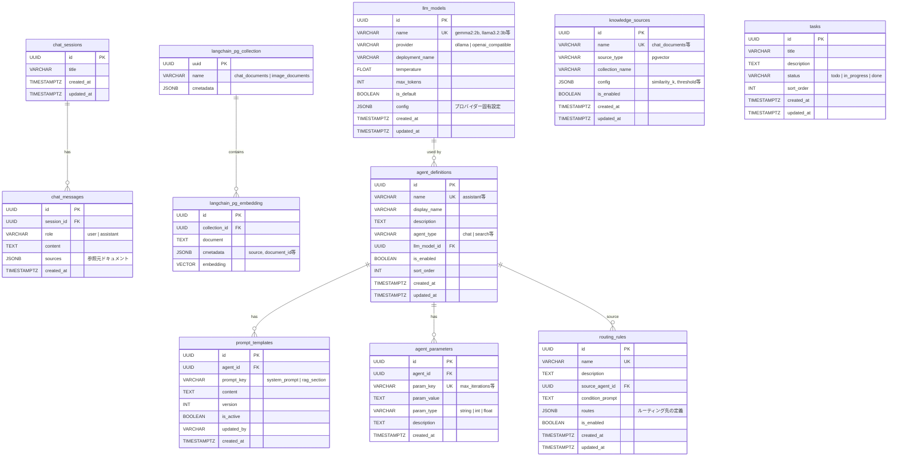

# ER図: chat-sandbox データベース

## 全体ER図

## テーブルグループ

### チャット系
ユーザーとの会話を管理するテーブル群。

| テーブル | 説明 | レコード増加速度 |
|---------|------|----------------|
| `chat_sessions` | 会話セッション | 会話作成ごと |
| `chat_messages` | メッセージ履歴 (user/bot) | メッセージごと |

### タスク管理系
プロジェクトのタスクをカンバンボードで管理。

| テーブル | 説明 | レコード増加速度 |
|---------|------|----------------|
| `tasks` | タスク (TODO/進行中/完了) | タスク作成ごと |

### ベクトルデータ (LangChain管理)
LangChainのPGVectorが自動管理するテーブル。直接操作しない。

| テーブル | 説明 | レコード増加速度 |
|---------|------|----------------|
| `langchain_pg_collection` | コレクション定義 (chat_documents, image_documents) | 固定 |
| `langchain_pg_embedding` | ドキュメントの埋め込みベクトル | ドキュメントアップロードごと |

### エージェント設定系
管理画面から変更可能な設定テーブル群。

> **作成タイミング**: これらのテーブルは `docker/postgres/init.sql` ではなく、
> アプリ起動時に `backend/repositories/agent_config_repository.py::_ensure_tables` が
> `CREATE TABLE IF NOT EXISTS` で作成し、初期シードも投入する（スキーマの正本はリポジトリ側）。

| テーブル | 説明 | レコード増加速度 |
|---------|------|----------------|
| `llm_models` | LLMプロバイダー定義 (Ollama, OpenAI互換) | 手動登録 |
| `agent_definitions` | エージェント定義 | 手動登録 |
| `prompt_templates` | プロンプト (バージョン管理付き) | プロンプト更新ごと |
| `agent_parameters` | エージェントパラメータ | 手動設定 |
| `routing_rules` | エージェントルーティング条件 | 手動設定 |
| `knowledge_sources` | ベクトル検索設定 (similarity_k等) | 手動設定 |

## リレーション一覧

| 親テーブル | 子テーブル | 関係 | CASCADE |
|-----------|-----------|------|---------|
| `chat_sessions` | `chat_messages` | 1:N | ON DELETE CASCADE |
| `langchain_pg_collection` | `langchain_pg_embedding` | 1:N | - |
| `llm_models` | `agent_definitions` | 1:N | - |
| `agent_definitions` | `prompt_templates` | 1:N | ON DELETE CASCADE |
| `agent_definitions` | `agent_parameters` | 1:N | ON DELETE CASCADE |
| `agent_definitions` | `routing_rules` | 1:N | - |
